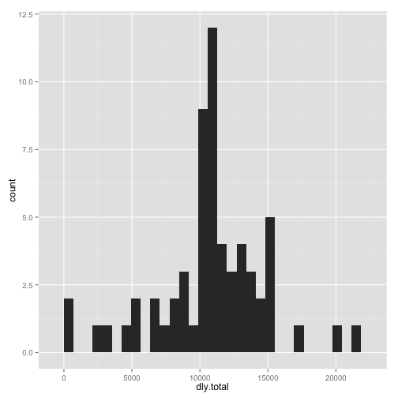

This is my response to the first assignment in the Reproducable Research class. For privacy reasons, I will set the working directory outside of this markdown file. With the directory set, the data must be loaded into R.


```r
data <- read.csv("activity.csv")
```
  
Next, let's just quickly check what this file looks like.  


```r
head(data)
```

```
##   steps       date interval
## 1    NA 2012-10-01        0
## 2    NA 2012-10-01        5
## 3    NA 2012-10-01       10
## 4    NA 2012-10-01       15
## 5    NA 2012-10-01       20
## 6    NA 2012-10-01       25
```

```r
tail(data)
```

```
##       steps       date interval
## 17563    NA 2012-11-30     2330
## 17564    NA 2012-11-30     2335
## 17565    NA 2012-11-30     2340
## 17566    NA 2012-11-30     2345
## 17567    NA 2012-11-30     2350
## 17568    NA 2012-11-30     2355
```

```r
str(data)
```

```
## 'data.frame':	17568 obs. of  3 variables:
##  $ steps   : int  NA NA NA NA NA NA NA NA NA NA ...
##  $ date    : Factor w/ 61 levels "2012-10-01","2012-10-02",..: 1 1 1 1 1 1 1 1 1 1 ...
##  $ interval: int  0 5 10 15 20 25 30 35 40 45 ...
```

```r
summary(data)
```

```
##      steps                date          interval     
##  Min.   :  0.00   2012-10-01:  288   Min.   :   0.0  
##  1st Qu.:  0.00   2012-10-02:  288   1st Qu.: 588.8  
##  Median :  0.00   2012-10-03:  288   Median :1177.5  
##  Mean   : 37.38   2012-10-04:  288   Mean   :1177.5  
##  3rd Qu.: 12.00   2012-10-05:  288   3rd Qu.:1766.2  
##  Max.   :806.00   2012-10-06:  288   Max.   :2355.0  
##  NA's   :2304     (Other)   :15840
```
  
Ok. That gives some idea of what is going on here. Now, as I think base R is not very intuitive, I am going to load a couple of packages from the Hadleyverse.  


```r
library("tidyr")
library("dplyr")
library("ggplot2")
library("lubridate")
library("grid")
library("gridExtra")
```
  
Great. Let's just move this into the dplyr wrapper for dataframes and we're off the the races.  


```r
df1 <- tbl_df(data)
df1
```

```
## Source: local data frame [17,568 x 3]
## 
##    steps       date interval
## 1     NA 2012-10-01        0
## 2     NA 2012-10-01        5
## 3     NA 2012-10-01       10
## 4     NA 2012-10-01       15
## 5     NA 2012-10-01       20
## 6     NA 2012-10-01       25
## 7     NA 2012-10-01       30
## 8     NA 2012-10-01       35
## 9     NA 2012-10-01       40
## 10    NA 2012-10-01       45
## ..   ...        ...      ...
```
  
One last thing. What sort of data are we working with here?  


```r
sapply(df1,class)
```

```
##     steps      date  interval 
## "integer"  "factor" "integer"
```
  
Date as factor. Likely not a dealbreaker here, but something that may need to be coerced later.  

First question, make a histogram of total number of steps taken each day.  


```r
hist_data <- df1 %>%
    group_by(date) %>%
    summarise(dly.total = sum(steps))

p0 <- qplot(dly.total,data=hist_data,geom = "histogram")
p0
```

```
## stat_bin: binwidth defaulted to range/30. Use 'binwidth = x' to adjust this.
```

 
  
Second question, create and report median and mean steps taken each day.  


```r
df2 <- df1 %>%
    group_by(date) %>%
    summarise(
        total = sum(steps, na.rm=TRUE),
        mean = mean(steps, na.rm=TRUE),
        median = median(steps, na.rm=TRUE)
        )
df2
```

```
## Source: local data frame [61 x 4]
## 
##          date total     mean median
## 1  2012-10-01     0      NaN     NA
## 2  2012-10-02   126  0.43750      0
## 3  2012-10-03 11352 39.41667      0
## 4  2012-10-04 12116 42.06944      0
## 5  2012-10-05 13294 46.15972      0
## 6  2012-10-06 15420 53.54167      0
## 7  2012-10-07 11015 38.24653      0
## 8  2012-10-08     0      NaN     NA
## 9  2012-10-09 12811 44.48264      0
## 10 2012-10-10  9900 34.37500      0
## ..        ...   ...      ...    ...
```
  
Cool. So now we want to resort this data. We want to see the average steps taken at each five minute interval. Let's give it  a shot!  


```r
df3 <- df1 %>%
    group_by(interval) %>%
    summarise(
        mean = mean(steps, na.rm=TRUE)
        )
df3
```

```
## Source: local data frame [288 x 2]
## 
##    interval      mean
## 1         0 1.7169811
## 2         5 0.3396226
## 3        10 0.1320755
## 4        15 0.1509434
## 5        20 0.0754717
## 6        25 2.0943396
## 7        30 0.5283019
## 8        35 0.8679245
## 9        40 0.0000000
## 10       45 1.4716981
## ..      ...       ...
```

```r
ggplot() + geom_line(data = df3, aes(x = interval, y = mean))
```

 
  
Great! Now we want to know which interval has the highest average number of steps.  


```r
filter(df3,mean==max(df3$mean))
```

```
## Source: local data frame [1 x 2]
## 
##   interval     mean
## 1      835 206.1698
```
  
Looks like 8:35 AM is a very productive time, indeed.  

Now with that out of the way, we need to deal with all of these blank values. Naturally, the first question is, how many of these NAs do I have, anyway?  


```r
table(is.na(df1))
```

```
## 
## FALSE  TRUE 
## 50400  2304
```
  
2,304. That is a rather large number. I guess we will need to do something about that.

  Luckily, it appears all of the missing values are steps.
  

```r
table(is.na(df1$steps))
```

```
## 
## FALSE  TRUE 
## 15264  2304
```

  The second step is to devise a naive method of dealing with these blank values. I think I will take the mean value at each interval and use that as a plug for the NAs. Luckily for us, we can just recycle that code for df3 from above. Using that, let's create a new dataframe called dfM, short for Master Dataframe, which we will use as processed data for the rest of the study.  
  

```r
testVal <- ifelse(is.na(df1$steps),
                  df3$mean[
                            match(df1$interval,df3$interval)
                            ], 
                  df1$steps
                  )

dfM <- data.frame(steps = testVal,date = df1$date, interval = df1$interval)

tbl_df(dfM)
```

```
## Source: local data frame [17,568 x 3]
## 
##        steps       date interval
## 1  1.7169811 2012-10-01        0
## 2  0.3396226 2012-10-01        5
## 3  0.1320755 2012-10-01       10
## 4  0.1509434 2012-10-01       15
## 5  0.0754717 2012-10-01       20
## 6  2.0943396 2012-10-01       25
## 7  0.5283019 2012-10-01       30
## 8  0.8679245 2012-10-01       35
## 9  0.0000000 2012-10-01       40
## 10 1.4716981 2012-10-01       45
## ..       ...        ...      ...
```

  Let's just test to really be sure our data is filled in.  
  

```r
table(is.na(dfM))
```

```
## 
## FALSE 
## 52704
```

  Great! Now let's re-run the analysis from above and see what the charts look like now.  
  

```r
hist_data1 <- dfM %>%
    group_by(date) %>%
    summarise(dly.total = sum(steps))

p1 <- qplot(dly.total,data=hist_data1,geom = "histogram")
p1
```

```
## stat_bin: binwidth defaulted to range/30. Use 'binwidth = x' to adjust this.
```

 

  So let's see how much this has changed things.  
  

```r
grid.arrange(p0, p1, ncol = 1, main = "A Comparison - notice the wider results around 10,000 and scale of y axis")
```

```
## stat_bin: binwidth defaulted to range/30. Use 'binwidth = x' to adjust this.
## stat_bin: binwidth defaulted to range/30. Use 'binwidth = x' to adjust this.
```

 

  So now let's recalculate mean and median values and see how they have changed.
  

```r
df4 <- dfM %>%
    group_by(date) %>%
    summarise(
        total = sum(steps, na.rm=TRUE),
        mean = mean(steps, na.rm=TRUE),
        median = median(steps, na.rm=TRUE)
        )

plot(df2$mean,type="l")
```

 

```r
plot(df4$mean,type="l")
```

 

  It doesn't look like anything has changed, except days that were blank were filled in. It appears that the missing data occurs randomly for an entire day, so the plug just fills in missing days. As an example, note how the intervals for the NA values don't occur at random, they occur sequantially throughout a single day.  
  

```r
df1$interval[is.na(df1$steps)]
```

```
##    [1]    0    5   10   15   20   25   30   35   40   45   50   55  100
##   [14]  105  110  115  120  125  130  135  140  145  150  155  200  205
##   [27]  210  215  220  225  230  235  240  245  250  255  300  305  310
##   [40]  315  320  325  330  335  340  345  350  355  400  405  410  415
##   [53]  420  425  430  435  440  445  450  455  500  505  510  515  520
##   [66]  525  530  535  540  545  550  555  600  605  610  615  620  625
##   [79]  630  635  640  645  650  655  700  705  710  715  720  725  730
##   [92]  735  740  745  750  755  800  805  810  815  820  825  830  835
##  [105]  840  845  850  855  900  905  910  915  920  925  930  935  940
##  [118]  945  950  955 1000 1005 1010 1015 1020 1025 1030 1035 1040 1045
##  [131] 1050 1055 1100 1105 1110 1115 1120 1125 1130 1135 1140 1145 1150
##  [144] 1155 1200 1205 1210 1215 1220 1225 1230 1235 1240 1245 1250 1255
##  [157] 1300 1305 1310 1315 1320 1325 1330 1335 1340 1345 1350 1355 1400
##  [170] 1405 1410 1415 1420 1425 1430 1435 1440 1445 1450 1455 1500 1505
##  [183] 1510 1515 1520 1525 1530 1535 1540 1545 1550 1555 1600 1605 1610
##  [196] 1615 1620 1625 1630 1635 1640 1645 1650 1655 1700 1705 1710 1715
##  [209] 1720 1725 1730 1735 1740 1745 1750 1755 1800 1805 1810 1815 1820
##  [222] 1825 1830 1835 1840 1845 1850 1855 1900 1905 1910 1915 1920 1925
##  [235] 1930 1935 1940 1945 1950 1955 2000 2005 2010 2015 2020 2025 2030
##  [248] 2035 2040 2045 2050 2055 2100 2105 2110 2115 2120 2125 2130 2135
##  [261] 2140 2145 2150 2155 2200 2205 2210 2215 2220 2225 2230 2235 2240
##  [274] 2245 2250 2255 2300 2305 2310 2315 2320 2325 2330 2335 2340 2345
##  [287] 2350 2355    0    5   10   15   20   25   30   35   40   45   50
##  [300]   55  100  105  110  115  120  125  130  135  140  145  150  155
##  [313]  200  205  210  215  220  225  230  235  240  245  250  255  300
##  [326]  305  310  315  320  325  330  335  340  345  350  355  400  405
##  [339]  410  415  420  425  430  435  440  445  450  455  500  505  510
##  [352]  515  520  525  530  535  540  545  550  555  600  605  610  615
##  [365]  620  625  630  635  640  645  650  655  700  705  710  715  720
##  [378]  725  730  735  740  745  750  755  800  805  810  815  820  825
##  [391]  830  835  840  845  850  855  900  905  910  915  920  925  930
##  [404]  935  940  945  950  955 1000 1005 1010 1015 1020 1025 1030 1035
##  [417] 1040 1045 1050 1055 1100 1105 1110 1115 1120 1125 1130 1135 1140
##  [430] 1145 1150 1155 1200 1205 1210 1215 1220 1225 1230 1235 1240 1245
##  [443] 1250 1255 1300 1305 1310 1315 1320 1325 1330 1335 1340 1345 1350
##  [456] 1355 1400 1405 1410 1415 1420 1425 1430 1435 1440 1445 1450 1455
##  [469] 1500 1505 1510 1515 1520 1525 1530 1535 1540 1545 1550 1555 1600
##  [482] 1605 1610 1615 1620 1625 1630 1635 1640 1645 1650 1655 1700 1705
##  [495] 1710 1715 1720 1725 1730 1735 1740 1745 1750 1755 1800 1805 1810
##  [508] 1815 1820 1825 1830 1835 1840 1845 1850 1855 1900 1905 1910 1915
##  [521] 1920 1925 1930 1935 1940 1945 1950 1955 2000 2005 2010 2015 2020
##  [534] 2025 2030 2035 2040 2045 2050 2055 2100 2105 2110 2115 2120 2125
##  [547] 2130 2135 2140 2145 2150 2155 2200 2205 2210 2215 2220 2225 2230
##  [560] 2235 2240 2245 2250 2255 2300 2305 2310 2315 2320 2325 2330 2335
##  [573] 2340 2345 2350 2355    0    5   10   15   20   25   30   35   40
##  [586]   45   50   55  100  105  110  115  120  125  130  135  140  145
##  [599]  150  155  200  205  210  215  220  225  230  235  240  245  250
##  [612]  255  300  305  310  315  320  325  330  335  340  345  350  355
##  [625]  400  405  410  415  420  425  430  435  440  445  450  455  500
##  [638]  505  510  515  520  525  530  535  540  545  550  555  600  605
##  [651]  610  615  620  625  630  635  640  645  650  655  700  705  710
##  [664]  715  720  725  730  735  740  745  750  755  800  805  810  815
##  [677]  820  825  830  835  840  845  850  855  900  905  910  915  920
##  [690]  925  930  935  940  945  950  955 1000 1005 1010 1015 1020 1025
##  [703] 1030 1035 1040 1045 1050 1055 1100 1105 1110 1115 1120 1125 1130
##  [716] 1135 1140 1145 1150 1155 1200 1205 1210 1215 1220 1225 1230 1235
##  [729] 1240 1245 1250 1255 1300 1305 1310 1315 1320 1325 1330 1335 1340
##  [742] 1345 1350 1355 1400 1405 1410 1415 1420 1425 1430 1435 1440 1445
##  [755] 1450 1455 1500 1505 1510 1515 1520 1525 1530 1535 1540 1545 1550
##  [768] 1555 1600 1605 1610 1615 1620 1625 1630 1635 1640 1645 1650 1655
##  [781] 1700 1705 1710 1715 1720 1725 1730 1735 1740 1745 1750 1755 1800
##  [794] 1805 1810 1815 1820 1825 1830 1835 1840 1845 1850 1855 1900 1905
##  [807] 1910 1915 1920 1925 1930 1935 1940 1945 1950 1955 2000 2005 2010
##  [820] 2015 2020 2025 2030 2035 2040 2045 2050 2055 2100 2105 2110 2115
##  [833] 2120 2125 2130 2135 2140 2145 2150 2155 2200 2205 2210 2215 2220
##  [846] 2225 2230 2235 2240 2245 2250 2255 2300 2305 2310 2315 2320 2325
##  [859] 2330 2335 2340 2345 2350 2355    0    5   10   15   20   25   30
##  [872]   35   40   45   50   55  100  105  110  115  120  125  130  135
##  [885]  140  145  150  155  200  205  210  215  220  225  230  235  240
##  [898]  245  250  255  300  305  310  315  320  325  330  335  340  345
##  [911]  350  355  400  405  410  415  420  425  430  435  440  445  450
##  [924]  455  500  505  510  515  520  525  530  535  540  545  550  555
##  [937]  600  605  610  615  620  625  630  635  640  645  650  655  700
##  [950]  705  710  715  720  725  730  735  740  745  750  755  800  805
##  [963]  810  815  820  825  830  835  840  845  850  855  900  905  910
##  [976]  915  920  925  930  935  940  945  950  955 1000 1005 1010 1015
##  [989] 1020 1025 1030 1035 1040 1045 1050 1055 1100 1105 1110 1115 1120
## [1002] 1125 1130 1135 1140 1145 1150 1155 1200 1205 1210 1215 1220 1225
## [1015] 1230 1235 1240 1245 1250 1255 1300 1305 1310 1315 1320 1325 1330
## [1028] 1335 1340 1345 1350 1355 1400 1405 1410 1415 1420 1425 1430 1435
## [1041] 1440 1445 1450 1455 1500 1505 1510 1515 1520 1525 1530 1535 1540
## [1054] 1545 1550 1555 1600 1605 1610 1615 1620 1625 1630 1635 1640 1645
## [1067] 1650 1655 1700 1705 1710 1715 1720 1725 1730 1735 1740 1745 1750
## [1080] 1755 1800 1805 1810 1815 1820 1825 1830 1835 1840 1845 1850 1855
## [1093] 1900 1905 1910 1915 1920 1925 1930 1935 1940 1945 1950 1955 2000
## [1106] 2005 2010 2015 2020 2025 2030 2035 2040 2045 2050 2055 2100 2105
## [1119] 2110 2115 2120 2125 2130 2135 2140 2145 2150 2155 2200 2205 2210
## [1132] 2215 2220 2225 2230 2235 2240 2245 2250 2255 2300 2305 2310 2315
## [1145] 2320 2325 2330 2335 2340 2345 2350 2355    0    5   10   15   20
## [1158]   25   30   35   40   45   50   55  100  105  110  115  120  125
## [1171]  130  135  140  145  150  155  200  205  210  215  220  225  230
## [1184]  235  240  245  250  255  300  305  310  315  320  325  330  335
## [1197]  340  345  350  355  400  405  410  415  420  425  430  435  440
## [1210]  445  450  455  500  505  510  515  520  525  530  535  540  545
## [1223]  550  555  600  605  610  615  620  625  630  635  640  645  650
## [1236]  655  700  705  710  715  720  725  730  735  740  745  750  755
## [1249]  800  805  810  815  820  825  830  835  840  845  850  855  900
## [1262]  905  910  915  920  925  930  935  940  945  950  955 1000 1005
## [1275] 1010 1015 1020 1025 1030 1035 1040 1045 1050 1055 1100 1105 1110
## [1288] 1115 1120 1125 1130 1135 1140 1145 1150 1155 1200 1205 1210 1215
## [1301] 1220 1225 1230 1235 1240 1245 1250 1255 1300 1305 1310 1315 1320
## [1314] 1325 1330 1335 1340 1345 1350 1355 1400 1405 1410 1415 1420 1425
## [1327] 1430 1435 1440 1445 1450 1455 1500 1505 1510 1515 1520 1525 1530
## [1340] 1535 1540 1545 1550 1555 1600 1605 1610 1615 1620 1625 1630 1635
## [1353] 1640 1645 1650 1655 1700 1705 1710 1715 1720 1725 1730 1735 1740
## [1366] 1745 1750 1755 1800 1805 1810 1815 1820 1825 1830 1835 1840 1845
## [1379] 1850 1855 1900 1905 1910 1915 1920 1925 1930 1935 1940 1945 1950
## [1392] 1955 2000 2005 2010 2015 2020 2025 2030 2035 2040 2045 2050 2055
## [1405] 2100 2105 2110 2115 2120 2125 2130 2135 2140 2145 2150 2155 2200
## [1418] 2205 2210 2215 2220 2225 2230 2235 2240 2245 2250 2255 2300 2305
## [1431] 2310 2315 2320 2325 2330 2335 2340 2345 2350 2355    0    5   10
## [1444]   15   20   25   30   35   40   45   50   55  100  105  110  115
## [1457]  120  125  130  135  140  145  150  155  200  205  210  215  220
## [1470]  225  230  235  240  245  250  255  300  305  310  315  320  325
## [1483]  330  335  340  345  350  355  400  405  410  415  420  425  430
## [1496]  435  440  445  450  455  500  505  510  515  520  525  530  535
## [1509]  540  545  550  555  600  605  610  615  620  625  630  635  640
## [1522]  645  650  655  700  705  710  715  720  725  730  735  740  745
## [1535]  750  755  800  805  810  815  820  825  830  835  840  845  850
## [1548]  855  900  905  910  915  920  925  930  935  940  945  950  955
## [1561] 1000 1005 1010 1015 1020 1025 1030 1035 1040 1045 1050 1055 1100
## [1574] 1105 1110 1115 1120 1125 1130 1135 1140 1145 1150 1155 1200 1205
## [1587] 1210 1215 1220 1225 1230 1235 1240 1245 1250 1255 1300 1305 1310
## [1600] 1315 1320 1325 1330 1335 1340 1345 1350 1355 1400 1405 1410 1415
## [1613] 1420 1425 1430 1435 1440 1445 1450 1455 1500 1505 1510 1515 1520
## [1626] 1525 1530 1535 1540 1545 1550 1555 1600 1605 1610 1615 1620 1625
## [1639] 1630 1635 1640 1645 1650 1655 1700 1705 1710 1715 1720 1725 1730
## [1652] 1735 1740 1745 1750 1755 1800 1805 1810 1815 1820 1825 1830 1835
## [1665] 1840 1845 1850 1855 1900 1905 1910 1915 1920 1925 1930 1935 1940
## [1678] 1945 1950 1955 2000 2005 2010 2015 2020 2025 2030 2035 2040 2045
## [1691] 2050 2055 2100 2105 2110 2115 2120 2125 2130 2135 2140 2145 2150
## [1704] 2155 2200 2205 2210 2215 2220 2225 2230 2235 2240 2245 2250 2255
## [1717] 2300 2305 2310 2315 2320 2325 2330 2335 2340 2345 2350 2355    0
## [1730]    5   10   15   20   25   30   35   40   45   50   55  100  105
## [1743]  110  115  120  125  130  135  140  145  150  155  200  205  210
## [1756]  215  220  225  230  235  240  245  250  255  300  305  310  315
## [1769]  320  325  330  335  340  345  350  355  400  405  410  415  420
## [1782]  425  430  435  440  445  450  455  500  505  510  515  520  525
## [1795]  530  535  540  545  550  555  600  605  610  615  620  625  630
## [1808]  635  640  645  650  655  700  705  710  715  720  725  730  735
## [1821]  740  745  750  755  800  805  810  815  820  825  830  835  840
## [1834]  845  850  855  900  905  910  915  920  925  930  935  940  945
## [1847]  950  955 1000 1005 1010 1015 1020 1025 1030 1035 1040 1045 1050
## [1860] 1055 1100 1105 1110 1115 1120 1125 1130 1135 1140 1145 1150 1155
## [1873] 1200 1205 1210 1215 1220 1225 1230 1235 1240 1245 1250 1255 1300
## [1886] 1305 1310 1315 1320 1325 1330 1335 1340 1345 1350 1355 1400 1405
## [1899] 1410 1415 1420 1425 1430 1435 1440 1445 1450 1455 1500 1505 1510
## [1912] 1515 1520 1525 1530 1535 1540 1545 1550 1555 1600 1605 1610 1615
## [1925] 1620 1625 1630 1635 1640 1645 1650 1655 1700 1705 1710 1715 1720
## [1938] 1725 1730 1735 1740 1745 1750 1755 1800 1805 1810 1815 1820 1825
## [1951] 1830 1835 1840 1845 1850 1855 1900 1905 1910 1915 1920 1925 1930
## [1964] 1935 1940 1945 1950 1955 2000 2005 2010 2015 2020 2025 2030 2035
## [1977] 2040 2045 2050 2055 2100 2105 2110 2115 2120 2125 2130 2135 2140
## [1990] 2145 2150 2155 2200 2205 2210 2215 2220 2225 2230 2235 2240 2245
## [2003] 2250 2255 2300 2305 2310 2315 2320 2325 2330 2335 2340 2345 2350
## [2016] 2355    0    5   10   15   20   25   30   35   40   45   50   55
## [2029]  100  105  110  115  120  125  130  135  140  145  150  155  200
## [2042]  205  210  215  220  225  230  235  240  245  250  255  300  305
## [2055]  310  315  320  325  330  335  340  345  350  355  400  405  410
## [2068]  415  420  425  430  435  440  445  450  455  500  505  510  515
## [2081]  520  525  530  535  540  545  550  555  600  605  610  615  620
## [2094]  625  630  635  640  645  650  655  700  705  710  715  720  725
## [2107]  730  735  740  745  750  755  800  805  810  815  820  825  830
## [2120]  835  840  845  850  855  900  905  910  915  920  925  930  935
## [2133]  940  945  950  955 1000 1005 1010 1015 1020 1025 1030 1035 1040
## [2146] 1045 1050 1055 1100 1105 1110 1115 1120 1125 1130 1135 1140 1145
## [2159] 1150 1155 1200 1205 1210 1215 1220 1225 1230 1235 1240 1245 1250
## [2172] 1255 1300 1305 1310 1315 1320 1325 1330 1335 1340 1345 1350 1355
## [2185] 1400 1405 1410 1415 1420 1425 1430 1435 1440 1445 1450 1455 1500
## [2198] 1505 1510 1515 1520 1525 1530 1535 1540 1545 1550 1555 1600 1605
## [2211] 1610 1615 1620 1625 1630 1635 1640 1645 1650 1655 1700 1705 1710
## [2224] 1715 1720 1725 1730 1735 1740 1745 1750 1755 1800 1805 1810 1815
## [2237] 1820 1825 1830 1835 1840 1845 1850 1855 1900 1905 1910 1915 1920
## [2250] 1925 1930 1935 1940 1945 1950 1955 2000 2005 2010 2015 2020 2025
## [2263] 2030 2035 2040 2045 2050 2055 2100 2105 2110 2115 2120 2125 2130
## [2276] 2135 2140 2145 2150 2155 2200 2205 2210 2215 2220 2225 2230 2235
## [2289] 2240 2245 2250 2255 2300 2305 2310 2315 2320 2325 2330 2335 2340
## [2302] 2345 2350 2355
```

  Alas, the time has come where we have to coerce our time data. Luckily, lubridate takes a lot of the ugliness of working with dates out of R.  
  

```r
dfM$date <- ymd(dfM$date)
```

  Not too bad after all. 
  
  Now we need to separate weekdays and weekends and see if there is any difference between the two.  
  
  

```r
dayType <- weekdays(dfM$date)
dayType <- ifelse(dayType == "Sunday" | dayType =="Saturday","weekend","weekday")
dfM1 <- cbind(dfM,dayType)
```

  Finally, let's plot the average steps taken on weekday and weekend days by 5 minute interval.


```r
dfWeekday <- dfM1 %>%
    group_by(interval) %>%
    filter(dayType == "weekday") %>%
    summarise(
        mean = mean(steps, na.rm=TRUE)
        )
    
dfWeekend <- dfM1 %>%
    group_by(interval) %>%
    filter(dayType == "weekend") %>%
    summarise(
        mean = mean(steps, na.rm=TRUE)
        )

p3 <- ggplot() + geom_line(data = dfWeekday, aes(x = interval, y = mean))

p4 <- ggplot() + geom_line(data = dfWeekend, aes(x = interval, y = mean))

grid.arrange(p3, p4, ncol = 1, main = "A Comparison - Weekdays are on top")
```

 

That is the report as requested.  

Thank you for your time and consideration.  
